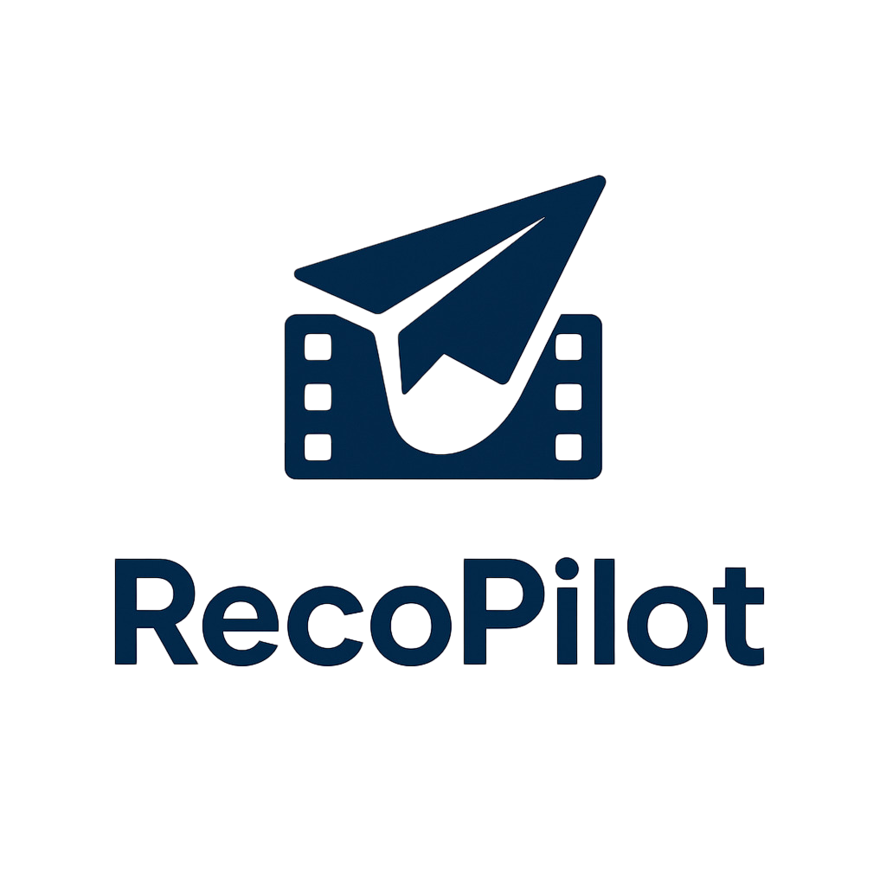
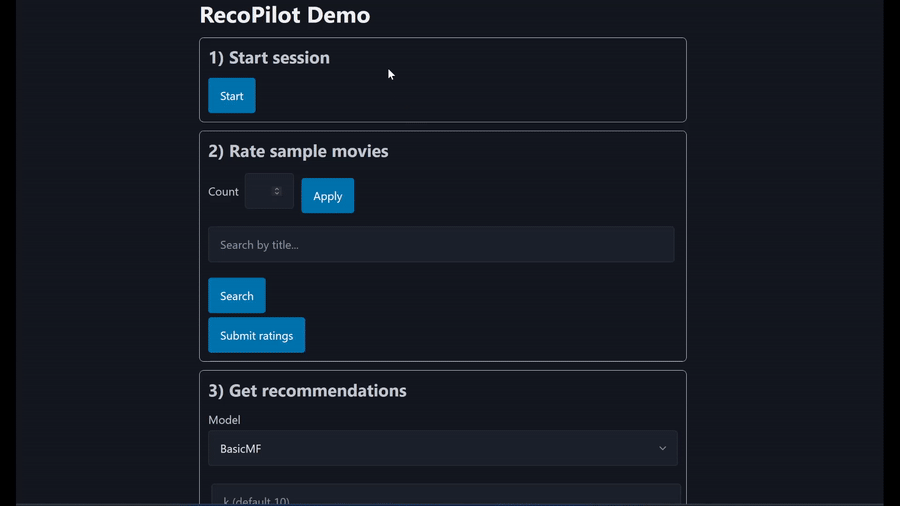

**A Movie-Lens 1M based movie-recommendation project**

[]() []()

---

## 1 Overview
RecoPilot is an end-to-end learning project that walks from data exploration through model deployment.

| Phase | Description | Status |
|-------|-------------|--------|
| 1 | Exploratory data analysis (EDA) | ✅ Complete |
| 2 | Data preprocessing & feature engineering | ✅ Complete |
| 3 | Algorithm implementation (baselines → CF → MF → hybrid) | ✅ Complete |
| 4 | Evaluation & model selection | ✅ Complete |
| 5 | Flask API + web demo | ✅ Complete |

---

## 2 Demo


[High quality (MP4)](docs/assets/reco-demo.mp4)

---

## 3 Project Structure
```text
RecoPilot/
├── README.md
├── LICENSE
├── requirements.txt
│
├── data/
│   ├── movies.dat                # raw MovieLens titles (used for UI)
│   ├── movies_processed.csv      # cleaned datasets used by models
│   ├── ratings_processed.csv
│   └── users_processed.csv
│
├── src/
│   └── algorithms/               # Recommendation algorithms (8 implementations)
│       ├── base.py              # Abstract base class
│       ├── baselines.py         # Global/user/movie averages (4 algorithms)
│       ├── collaborative_filtering.py # User-based & item-based CF
│       ├── matrix_factorization.py # Basic SGD & SVD implementations
│       ├── content_based.py     # Genre & demographic filtering
│       └── hybrid.py            # Weighted combination strategy
│
├── docs/
│   ├── phase1-data-exploration-summary.md
│   ├── phase2-data-preprocessing.md
│   ├── phase3-algorithm-implementation.md
│   ├── phase4/
│   │   ├── conclusion.md          # Phase 4 summary and results
│   │   └── plots/                 # Phase 4 result plots
│   └── assets/
│       ├── logo.png               # Project logo (transparent background)
│       ├── reco-demo.gif          # README demo (optimized GIF)
│       └── reco-demo.mp4          # README demo (HQ MP4)
│
├── models/                       # saved best parameters (unfitted JSON)
├── tests/                        # algorithm tests
│   ├── test_baselines.py         # baseline algorithm tests
│   ├── test_collaborative_filtering.py # CF algorithm tests
│   ├── test_matrix_factorization.py    # MF algorithm tests
│   └── test_hybrid.py            # hybrid system tests
└── app/                          # Flask API + front-end
    ├── server.py                 # REST endpoints + TMDB posters
    └── static/
        └── index.html            # Single-page demo (Pico.css)
```

---

## 4 Installation
```bash
git clone https://github.com/Arsenii-Ahamalov/RecoPilot.git
cd RecoPilot
python -m venv venv           # create venv
source venv/bin/activate      # Linux/macOS
# venv\Scripts\activate       # Windows
pip install -r requirements.txt
```

---

## 5 Run the project

### Dev server (simple)
Run the Flask app:
```bash
python app/server.py
```
Open `http://localhost:5000`.

Notes:
- The app reads data from `data/` and parameters from `models/`. Ensure these files are present.
- On Windows, prefer WSL and run the same commands from Ubuntu.
 - Posters are enabled out of the box. Setting `TMDB_API_KEY` is optional if you want to use your own key.

### Production-style (Gunicorn)
```bash
gunicorn app.server:app -b 0.0.0.0:5000 --workers 1 --threads 1 --timeout 120
```
Open `http://localhost:5000`.

---

## 6 Data Preparation
Pre-processed CSV files (`movies_processed.csv`, `ratings_processed.csv`, `users_processed.csv`) live directly in the `data/` folder. To regenerate them, open and run **`src/data_preprocessing.ipynb`**.

---

## 7 Implemented Algorithms (Phase 3) ✅
1. **Baselines** – 4 algorithms: global, user, movie averages + bias model
2. **Memory-based CF** – UserBasedCF (Pearson) & ItemBasedCF (adj. cosine)
3. **Matrix factorization** – BasicMF (SGD) & SVD with bias terms
4. **Content-based** – Genre preferences & demographic similarity  
5. **Hybrid** – Flexible weighted combination with error handling

**Comprehensive features**: Full documentation, tests, and a working web demo.

---

## 8 Model Storage Strategy
**We store unfitted JSON configs with best hyperparameters** for production flexibility:
- **Unfitted configs**: Instantiate classes and fit on current data
- **Best parameters**: Frozen from Phase 4 tuning (see `models/*.json`)
- **Hybrid config**: Selected models and uniform weights saved in `models/Hybrid.json`

## 9 Road-map
- [x] **Phase 1**: Data exploration & analysis
- [x] **Phase 2**: Data preprocessing & feature engineering  
- [x] **Phase 3**: Algorithm implementation (8 algorithms + comprehensive testing)
- [x] **Phase 4**: Evaluation & model comparison
- [x] **Phase 5**: Flask API + web demo  

---

## 10 License
MIT – see `LICENSE`.

---
*Last updated 2025-08-12*
