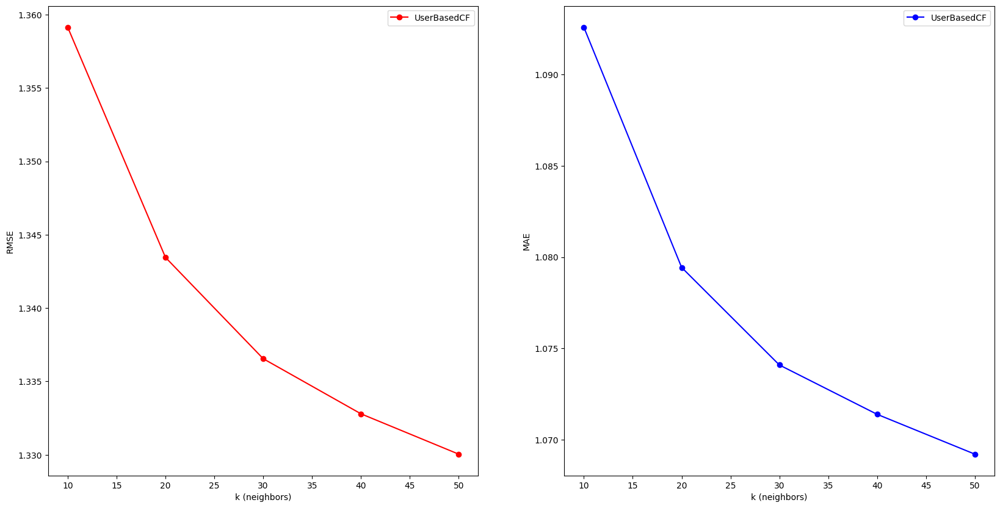
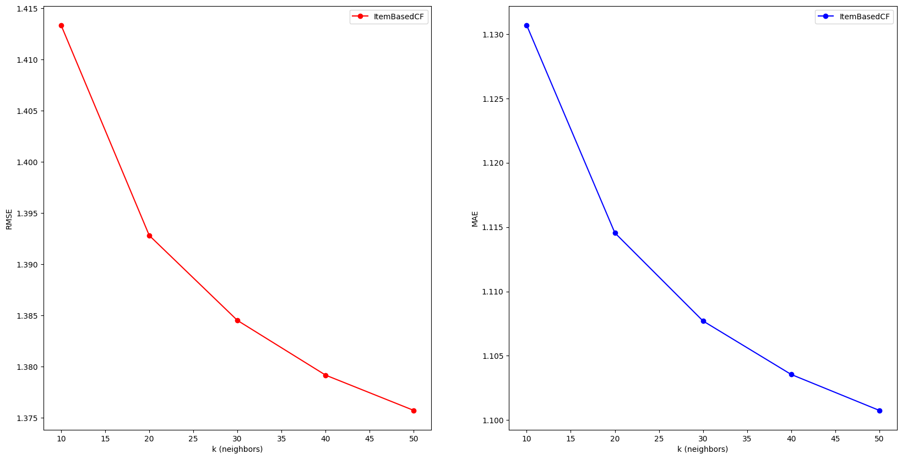
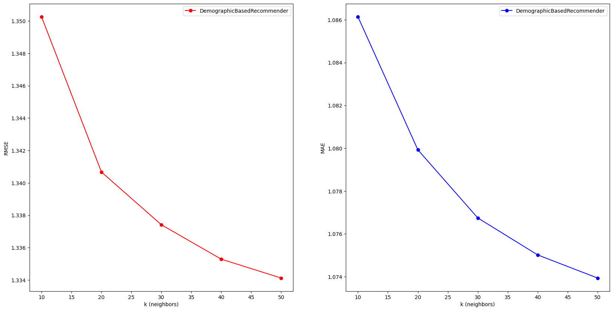
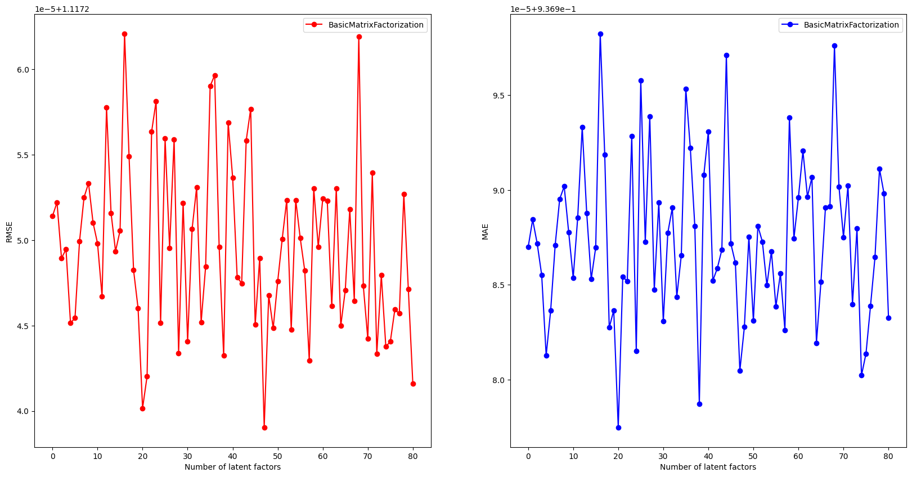
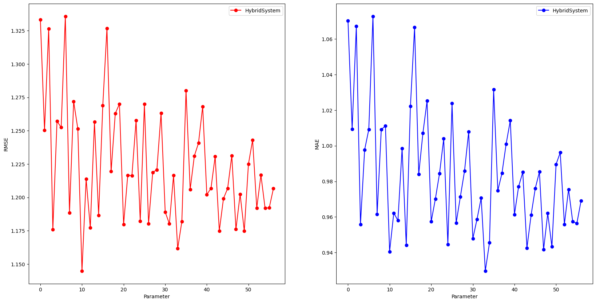

## Phase 4 – Model evaluation and selection ✅

This phase benchmarks the implemented recommenders on a held‑out validation split, tunes key hyperparameters, and selects a final configuration for deployment. Best model parameters are stored as unfitted JSON configs in `models/` so production can refit on fresh data.

### Data and protocol 🧪
- Dataset: MovieLens (processed CSVs in `data/`)
- Sample: ~500 users for coarse sweeps (seeded), per‑user 80/20 warm‑start split
- Metrics: RMSE (primary), MAE (secondary); lower is better 📉
- Reproducibility: fixed seeds and stable evaluation order (per‑pair `predict(user,item)`) 🔁

### Algorithms and best parameters ⚙️
- UserBasedCF: `k = 50` → `models/UserBasedCF.json`
- ItemBasedCF: `k = 50` → `models/ItemBasedCF.json`
- GenreBasedRecommender: no tunables → `models/GenreBasedRecommender.json`
- DemographicBasedRecommender: `k = 50` → `models/DemographicBasedRecommender.json`
- BasicMatrixFactorization: `k = 60, epochs = 100, learning_rate = 0.0005, reg = 0.1` → `models/BasicMatrixFactorization.json`
- SVDMatrixFactorization: `k = 60` → `models/SVDMatrixFactorization.json`

Hybrid (uniform weights; tuned by cached‑prediction search over all non‑trivial subsets) 🧩:
- Selected models: `GenreBasedRecommender`, `BasicMatrixFactorization`
- Weights: `[0.5, 0.5]` → `models/Hybrid.json`

### Validation metrics (current run) 📈

| Model                         | RMSE | MAE  | Notes                          |
|------------------------------|-----:|-----:|--------------------------------|
| BasicMatrixFactorization (k=60, epochs=100, lr=0.0005, reg=0.1) | 1.12 | 0.94 | stable SGD                      |
| Hybrid: Genre + BasicMF (0.5/0.5) | 1.14 | 0.93 | best hybrid (uniform weights)  |
| GenreBasedRecommender        | 1.22 | 0.98 |                                |
| UserBasedCF (k=50)           | 1.33 | 1.07 |                                |
| DemographicBasedRecommender (k=50) | 1.33 | 1.07 |                        |
| ItemBasedCF (k=50)           | 1.38 | 1.10 | optimized similarity + caching |
| SVDMatrixFactorization (k=60)| 1.48 | 1.15 |                                |

Visuals:
- User-based CF: 
- Item-based CF: 
- Demographic: 
- Basic MF: 
- Hybrid combinations: 

### Key implementation notes 🧠
- Fixed evaluation alignment: predictions are computed in the same order as ground truth.
- CF plot shows minima (lower is better) and highlights best `k`.
- ItemBasedCF performance optimization:
  - Precomputed adjusted ratings per item; fast numpy intersect/dot for similarities
  - Optional cap on user history considered per prediction
- BasicMF stability:
  - Smaller float64 init, gradient averaging, clipping, and LR decay to prevent overflow
- Hybrid tuning optimization:
  - Prefit each model once; cache per‑model predictions; evaluate all subsets by column averaging (seconds instead of hours)

### Results summary 🏁
RMSE/MAE values vary with sample and seed. On this run:
- Best single model by RMSE: BasicMF (RMSE 1.12, MAE 0.94)
- Best hybrid (uniform weights): Genre + BasicMF (RMSE 1.14, MAE 0.93)

Interpretation: if RMSE is the primary objective, select BasicMF. If MAE matters more, the simple 2‑model hybrid slightly improves MAE while staying close on RMSE. CF underperforms here due to sparse user overlaps; item/content/latent models are more robust in this regime.

### What’s next (Phase 5) 🚀
- Productionize: small loader that instantiates models from JSON and fits on current data
- Optional: learn hybrid weights via constrained least squares instead of uniform
- API & demo app: expose `predict`/`recommend` endpoints; add periodic retraining

Artifacts 📦:
- Best params (JSON): see `models/`
- Models results plots(PNG): see `docs/phase4/plots/`